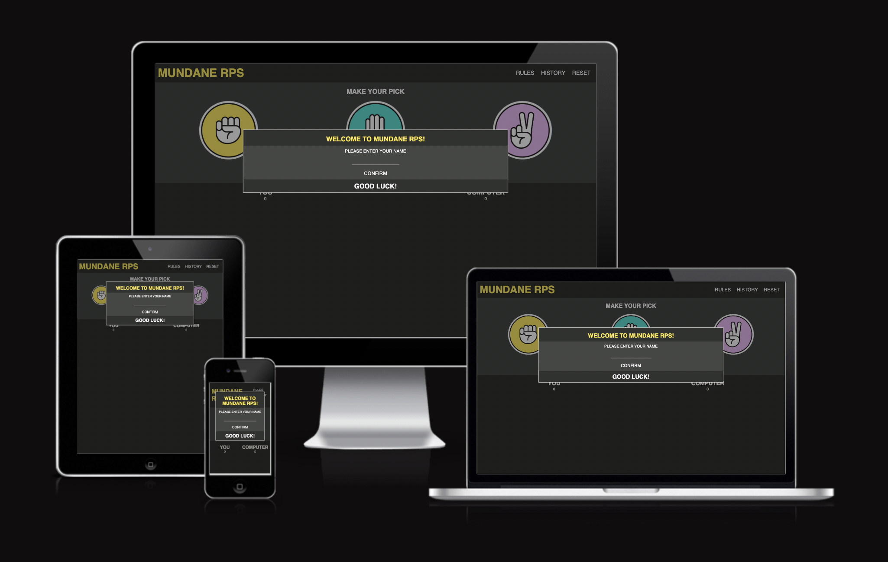

# MUNDANE RPS

This is a rock paper scissors game with a minimal approach to make it as simple as the real game is.
These are some functions to look for.
* Player assigned username
* Rules and intro popup interface
* End of game and reset popup interface
* A match histroy section to display past results
* Scoreboard and match result tracking
* Responsive design

### The Design of the Webpage: 
* The design of the page caters to the fact it is simple and pleasing to look at, with a simple game to pass the time.


To view the deployed project click [here](https://sizimon.github.io/P2-Resub/). 

 


#  UXD

### Website Intentions
* The intentions of the website is simplicity and functionality, the website intends to offer a simple game, with a neutral color palette and leave a relaxing impression on the user. All while offering a fun simple game of chance.

#### For The User
* A clear direction of where to click to get the desired result, with a natural flow of information as the user plays the game, minimal buttons, just to keep it simple.

#### For The Developer
* The process was intended to be more mechanically enticing. I built this project as simple as possible, so it would help not only the user enjoy a simple game, but for me as a beginner developer to come to a better understanding with how HTML,CSS and Javascript come together to make things happen.


# PROCESS

* The design process was helped by WebDevSimplified, who put together a great video which created a simple RPS game, I took influence from him in order to get my ideas for the webpage.
* Since this is my resubmission project, I was simply polishing my exisiting code, making sure the UI has a clean appeal with no errors to be encountered by the user, especially regarding responsiveness.
* The fonts and colors I used were kept minimal, but complimented eachother well. The popups in the page were not invasive and easy to navigate around.
* The simple design created an atmosphere where I was left clicking and resetting for some time, just because of how pleasing the page was to look at for the eye.


# PAGE FEATURES

## Intro Popup 
* The intro screen when the page load is displayed and gives basic information about the game. 
* It also adds a name input with a submit button, which stores the name written by the player into the localstorage, which is later used to set the players name within the game according to the input.
  


## Game Screen 
* The Game screen after inputting name in the intro screen.
* Features a clean minimal design, with a title, clear options to select and a scoreboard.
 


## Round Result 
* How the round played out is displayed just below the selections, and tells you whether you won/lost or if the game was a draw.
 


## Match History
* After clicking the selection of choice and the round ends, the result is displayed in the match history.
 


## Game End
* The Game ends when someone reaches the score of 3 (either the computer or player).
* When this happens the popup appears informing you whether you won or lost.
* Upon closing this popup, the match resets.
 

# Navigation Bar Elements
* The navigation bar is simple and easy to understand, consisting of three elements.
* The Rules Button: A button which will call a popup modal to display the rules of the game to the player.
* The History Button: A button which will call a popup modal to display a scoreboard of games the players has won or lost. 
* The Reset Button: A button which will reset the round score and round history display, in effect resetting the round.
## Rules Modal

* The rules modal which shows the rules of the game to the user.
## Game Score History

* The game history modal which shows score based of matches won.


# DESIGN CHANGES
Due to this being my resubmission project the only real design changes were to assist my issues with responsiveness on some devices, the CSS overhaul as previously mention let me be more in control with my responsiveness, and took less work to get the required result. (SINCE THE PROJECT WAS FAILED ONLY BASED OFF "Inaccessible input field to progress, Defensive programming", THIS WAS A CRUCIAL OVERHAULT TO MAKE SURE USERS ARE NOT LOCKED OUT FROM THE WEBSITE) 


# FUTURE FEATURES
These are the features I would like to include in the game:
* A match selection screen (where one can pick from best of 3, best to 3, and one in a chamber)
* A window on the corner of the screen which displays the past 3 match results (e.g 3-2)


# TESTING
## HTML:

There was one minor error popup about the form not needing a type attribute, that was quickly fixed and the HTML passed the validator.


## CSS:

The CSS passed flawlessly.


## JS:

JS also passed with no errors other than some missing semicolons which were fixed, the highlighted unused variables are called in HTML button onclick attributes.


## Lighthouse (Mobile):


## Lighthouse (Desktop):


## BUGS:
* I had issues with trying to display the images in the the match history box, instead of the selection being displayed as the image, it was showing the filepath, I was trying to resolve it for hours, and the following code was the fix. 
``` const imgID = choice.image;
    const img = document.createElement('img');
    img.src = imgID;
    const div = document.createElement('div');
    div.appendChild(img); 
```

* There was another issue with the user being able to submit the form to collect their name without any input, this was resolved using the checkValidity() function on the form input.
* There were some other issues in responsiveness, therefore I devided to fix the styling by doing a CSS overhaul and creating a more flexible stylesheet, which resulted in less complex media queries.


# SITE DEPLOYMENT:
### TO DEPLOY THE SITE
1. In the GitHub repository of the website, go to the "Settings".
2. In the menu on the left side of the screen, go to the "Code and Automation" section and click on "Pages".
3. Under the GitHub Pages, select the Main Branch from the dropdown menu.
4. Optionally select the folder in the following dropdown menu.
5. Save and automatically the site is published.


# CREDITS: 
## CODE:
[Guide](https://www.youtube.com/c/EasyTutorialsVideo) by EasyTutorials to help with the CSS aspect of popup boxes.

[Tutorial](https://github.com/WebDevSimplified/Rock-Paper-Scissors-In-JavaScript/blob/master/script.js) video by WebDevSimplified which help with the first few steps to understanding how to make an RPS.


## TESTING:
[PageSpeed](https://pagespeed.web.dev/) for Performance Testing.

[Google](https://fonts.google.com/) Fonts for fonts.

[UI](https://ui.dev/amiresponsive?url=https://sizimon.github.io/P2/) for Responsiveness checking.

My Code Institute Tutor [Rahal](https://rahullakhanpal.in), for helping me analyse my project and see what needs improving.


## DESIGN:
[Nightwolfdezines](https://www.vecteezy.com/members/nightwolfdezines) for providing the images used as selection buttons.

[Favicon](https://favicon.io/) website which helped convert an image for a favicon.
